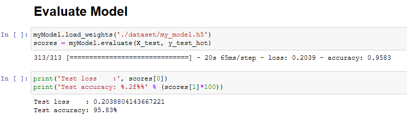
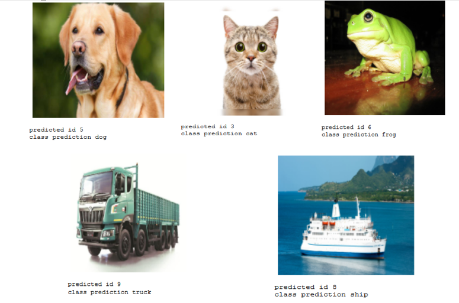

### Multiclass Classification using-inception-resnet-v2 model for cifar10 dataset
#### ================================================================
#### - In this program using CNN(using-inception-resnet-v2 model) to classifify images from cifar10 dataset. 
#### - This program is succesfuly classify cifar10 dataset with an accuracy of 95.8% and can classify several testing images from the internet

#### - Test the image from the internet 

